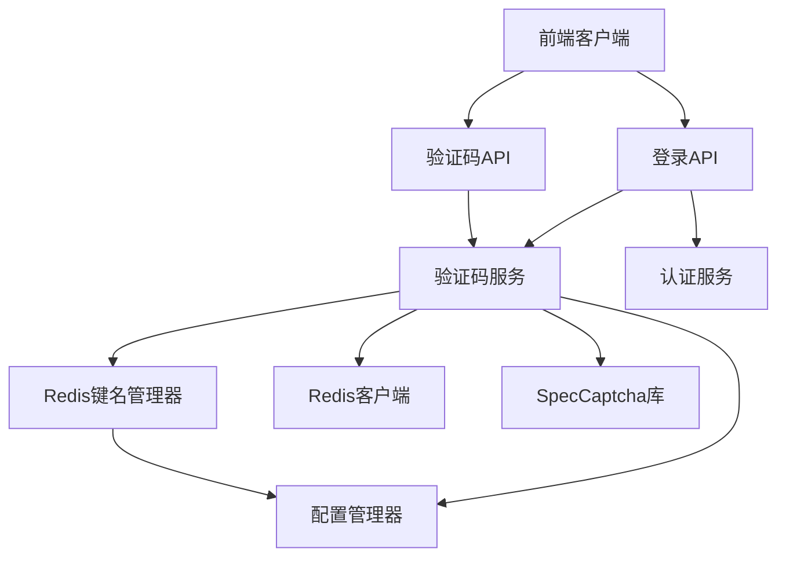
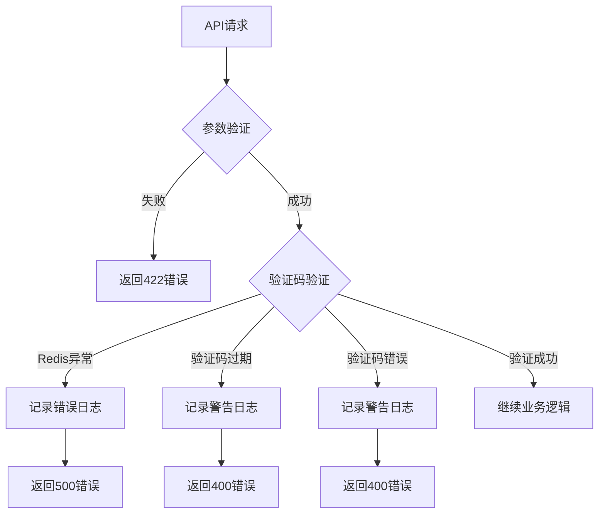

# 设计文档

## 概述

本设计文档描述了登录验证码集成功能的技术实现方案。该功能将集成 easy-captcha-python 库为管理员登录添加图形验证码验证，并重构 Redis 键名管理系统，实现统一的键名规范。

核心目标：
1. 集成 SpecCaptcha 生成图形验证码
2. 实现 Redis 键名统一管理机制
3. 更新登录流程支持验证码验证
4. 提供验证码配置化管理

## 架构

### 系统架构图



### 分层架构

```
┌─────────────────────────────────────┐
│         API Layer (FastAPI)         │
│  - GET /captcha                     │
│  - POST /login (updated)            │
└─────────────────────────────────────┘
                 ↓
┌─────────────────────────────────────┐
│        Service Layer                │
│  - CaptchaService                   │
│  - AdminUserService                 │
└─────────────────────────────────────┘
                 ↓
┌─────────────────────────────────────┐
│      Infrastructure Layer           │
│  - RedisKeyManager                  │
│  - Redis Client                     │
│  - SpecCaptcha (easy-captcha)       │
└─────────────────────────────────────┘
                 ↓
┌─────────────────────────────────────┐
│       Configuration Layer           │
│  - config.yaml                      │
│  - Settings (Pydantic)              │
└─────────────────────────────────────┘
```

## 组件和接口

### 1. Redis 键名管理器 (RedisKeyManager)

**位置**: `app/core/redis_keys.py`

**职责**: 
- 提供统一的 Redis 键名生成和管理
- 定义键名模式和过期时间
- 支持参数化键名生成

**接口设计**:

```python
from enum import Enum
from typing import Optional

class RedisKeyPattern(str, Enum):
    """Redis 键名模式枚举"""
    # 验证码相关
    CAPTCHA = "admin:captcha:{key}"
    
    # 可扩展其他键名模式
    # SESSION = "admin:session:{user_id}"
    # RATE_LIMIT = "admin:rate_limit:{ip}:{endpoint}"

class RedisKeyConfig:
    """Redis 键名配置"""
    # 键名过期时间（秒）
    CAPTCHA_EXPIRE = 300  # 5分钟
    
    # 键名前缀（可根据环境配置）
    KEY_PREFIX = ""

class RedisKeyManager:
    """Redis 键名管理器"""
    
    @staticmethod
    def get_captcha_key(captcha_id: str) -> str:
        """
        生成验证码键名
        
        Args:
            captcha_id: 验证码唯一标识
            
        Returns:
            完整的 Redis 键名
        """
        pattern = RedisKeyPattern.CAPTCHA.value
        key = pattern.format(key=captcha_id)
        if RedisKeyConfig.KEY_PREFIX:
            return f"{RedisKeyConfig.KEY_PREFIX}:{key}"
        return key
    
    @staticmethod
    def get_captcha_expire() -> int:
        """获取验证码过期时间"""
        return RedisKeyConfig.CAPTCHA_EXPIRE
    
    @staticmethod
    def set_key_prefix(prefix: str) -> None:
        """设置键名前缀（用于环境隔离）"""
        RedisKeyConfig.KEY_PREFIX = prefix
```

### 2. 验证码服务 (CaptchaService)

**位置**: `app/services/captcha_service.py`

**职责**:
- 生成验证码图片和唯一标识
- 存储验证码到 Redis
- 验证用户输入的验证码
- 管理验证码生命周期

**接口设计**:

```python
import uuid
from io import BytesIO
from typing import Tuple, Optional
from easy_captcha import SpecCaptcha
from redis import Redis
from app.core.redis import get_redis
from app.core.redis_keys import RedisKeyManager
from app.core.config import settings
from app.core.logger import app_logger

class CaptchaService:
    """验证码服务"""
    
    @staticmethod
    def generate_captcha() -> Tuple[str, str]:
        """
        生成验证码
        
        Returns:
            (captcha_key, base64_image): 验证码键和Base64图片数据
        """
        try:
            # 从配置读取验证码参数
            width = getattr(settings, 'captcha', {}).get('width', 130)
            height = getattr(settings, 'captcha', {}).get('height', 48)
            length = getattr(settings, 'captcha', {}).get('length', 5)
            
            # 创建验证码实例
            captcha = SpecCaptcha(width, height, length)
            
            # 获取验证码文本（转小写）
            code = captcha.text().lower()
            
            # 生成唯一标识
            captcha_key = str(uuid.uuid4())
            
            # 存储到 Redis
            redis_client = get_redis()
            redis_key = RedisKeyManager.get_captcha_key(captcha_key)
            expire_time = RedisKeyManager.get_captcha_expire()
            
            redis_client.setex(redis_key, expire_time, code)
            
            # 生成 Base64 图片
            base64_image = captcha.to_base64()
            
            app_logger.info(f"验证码生成成功: key={captcha_key}")
            
            return captcha_key, base64_image
            
        except Exception as e:
            app_logger.error(f"验证码生成失败: {str(e)}")
            raise
    
    @staticmethod
    def verify_captcha(captcha_key: str, captcha_code: str) -> bool:
        """
        验证验证码
        
        Args:
            captcha_key: 验证码键
            captcha_code: 用户输入的验证码
            
        Returns:
            验证是否成功
        """
        try:
            redis_client = get_redis()
            redis_key = RedisKeyManager.get_captcha_key(captcha_key)
            
            # 从 Redis 获取存储的验证码
            stored_code = redis_client.get(redis_key)
            
            if not stored_code:
                app_logger.warning(f"验证码不存在或已过期: key={captcha_key}")
                return False
            
            # 比较验证码（不区分大小写）
            is_valid = stored_code.lower() == captcha_code.lower()
            
            if is_valid:
                # 验证成功，立即删除验证码（防止重复使用）
                redis_client.delete(redis_key)
                app_logger.info(f"验证码验证成功: key={captcha_key}")
            else:
                app_logger.warning(f"验证码验证失败: key={captcha_key}")
            
            return is_valid
            
        except Exception as e:
            app_logger.error(f"验证码验证异常: {str(e)}")
            return False
```

### 3. 验证码 Schema

**位置**: `app/schemas/captcha.py`

**职责**: 定义验证码相关的请求和响应模型

**接口设计**:

```python
from pydantic import BaseModel, Field

class CaptchaResponse(BaseModel):
    """验证码响应模型"""
    captcha_key: str = Field(..., description="验证码唯一标识")
    captcha_image: str = Field(..., description="Base64编码的验证码图片")

class LoginWithCaptcha(BaseModel):
    """带验证码的登录请求模型"""
    username: str = Field(..., description="用户名", min_length=1, max_length=50)
    password: str = Field(..., description="密码", min_length=1)
    captcha_key: str = Field(..., description="验证码键")
    captcha_code: str = Field(..., description="验证码", min_length=1, max_length=10)
```

### 4. 更新认证 API

**位置**: `app/api/admin/auth.py`

**更新内容**:
1. 添加获取验证码接口
2. 更新登录接口支持验证码验证

**接口设计**:

```python
@router.get("/captcha", response_model=Response[CaptchaResponse], summary="获取验证码")
def get_captcha():
    """
    获取验证码
    
    返回验证码的唯一标识和Base64编码的图片数据
    """
    try:
        captcha_key, captcha_image = CaptchaService.generate_captcha()
        
        return Response(
            code=200,
            message="获取验证码成功",
            data=CaptchaResponse(
                captcha_key=captcha_key,
                captcha_image=captcha_image
            )
        )
    except Exception as e:
        app_logger.error(f"获取验证码失败: {str(e)}")
        raise HTTPException(
            status_code=status.HTTP_500_INTERNAL_SERVER_ERROR,
            detail="获取验证码失败"
        )

@router.post("/login", response_model=Response[LoginResponse], summary="管理员用户登录")
def login(
    user_in: LoginWithCaptcha,
    db: Session = Depends(get_db)
):
    """
    管理员用户登录（带验证码验证）
    
    - **username**: 用户名
    - **password**: 密码
    - **captcha_key**: 验证码键
    - **captcha_code**: 验证码
    """
    # 1. 验证验证码
    if not CaptchaService.verify_captcha(user_in.captcha_key, user_in.captcha_code):
        raise HTTPException(
            status_code=status.HTTP_400_BAD_REQUEST,
            detail="验证码错误或已过期",
        )
    
    # 2. 验证用户名密码
    user = AdminUserService.authenticate(db, user_in.username, user_in.password)
    
    if not user:
        raise HTTPException(
            status_code=status.HTTP_401_UNAUTHORIZED,
            detail="用户名或密码错误",
        )
    
    # 3. 生成token和返回菜单（原有逻辑）
    # ... 保持原有代码不变
```

## 数据模型

### Redis 数据结构

**验证码存储**:
```
Key: admin:captcha:{uuid}
Value: "abc12" (验证码文本，小写)
TTL: 300秒 (5分钟)
```

**示例**:
```
Key: admin:captcha:550e8400-e29b-41d4-a716-446655440000
Value: "8k3p9"
TTL: 300
```

### 配置模型

**位置**: `app/core/config.py`

**新增配置类**:

```python
class CaptchaConfig(BaseModel):
    """验证码配置"""
    width: int = 130
    height: int = 48
    length: int = 5
    expire_seconds: int = 300

class Settings(BaseSettings):
    """全局配置类"""
    environment: str = "DEV"
    app: AppConfig
    database: DatabaseConfig
    redis: RedisConfig
    jwt: JWTConfig
    logging: LoggingConfig
    cors: CORSConfig
    api_log: APILogConfig
    captcha: CaptchaConfig = CaptchaConfig()  # 新增验证码配置
```

**config.yaml 新增配置**:

```yaml
dev:
  # ... 其他配置
  
  # 验证码配置
  captcha:
    width: 130
    height: 48
    length: 5
    expire_seconds: 300
```

## 正确性属性

*属性是关于系统应该满足的特征或行为的形式化陈述，本质上是对系统正确性的规范。属性作为人类可读规范和机器可验证正确性保证之间的桥梁。*

### 属性 1: 验证码唯一性

*对于任意* 两次验证码生成请求，生成的 captcha_key 应该是唯一的，不会发生冲突

**验证需求**: 1.2, 2.3

### 属性 2: 验证码过期时间一致性

*对于任意* 生成的验证码，其在 Redis 中的 TTL 应该等于配置的过期时间（误差在1秒内）

**验证需求**: 2.6, 4.6

### 属性 3: 验证码验证后删除

*对于任意* 验证成功的验证码，该验证码应该立即从 Redis 中删除，后续使用相同 captcha_key 验证应该失败

**验证需求**: 3.7

### 属性 4: 验证码大小写不敏感

*对于任意* 验证码，无论用户输入大写、小写或混合大小写，只要字符匹配就应该验证成功

**验证需求**: 3.4

### 属性 5: Redis 键名格式一致性

*对于任意* 验证码 ID，通过 RedisKeyManager 生成的键名应该严格遵循 "admin:captcha:{key}" 格式

**验证需求**: 1.2, 1.7

### 属性 6: 验证码长度正确性

*对于任意* 生成的验证码，其文本长度应该等于配置的 length 参数

**验证需求**: 2.2

### 属性 7: Base64 图片格式正确性

*对于任意* 生成的验证码图片，其 Base64 编码应该以 "data:image/png;base64," 开头，且可以被正确解码

**验证需求**: 2.9

### 属性 8: 验证失败不删除验证码

*对于任意* 验证失败的验证码，该验证码应该保留在 Redis 中，允许用户重试直到过期

**验证需求**: 3.8

### 属性 9: 登录流程验证码优先

*对于任意* 登录请求，验证码验证应该在用户名密码验证之前执行，验证码错误时不应该执行密码验证

**验证需求**: 3.2

### 属性 10: 配置默认值回退

*对于任意* 验证码配置项，当配置文件中不存在该配置时，应该使用预定义的默认值

**验证需求**: 4.6

## 错误处理

### 错误类型和处理策略

| 错误类型 | HTTP状态码 | 错误信息 | 处理策略 |
|---------|-----------|---------|---------|
| 验证码生成失败 | 500 | "获取验证码失败" | 记录错误日志，返回通用错误信息 |
| Redis 连接失败 | 500 | "系统服务异常" | 记录错误日志，返回通用错误信息 |
| 验证码不存在或过期 | 400 | "验证码错误或已过期" | 记录警告日志，提示用户重新获取 |
| 验证码错误 | 400 | "验证码错误或已过期" | 记录警告日志，保留验证码允许重试 |
| 缺少验证码参数 | 422 | Pydantic 验证错误 | 返回参数验证错误详情 |

### 错误处理流程



### 日志记录策略

**日志级别**:
- `INFO`: 验证码生成成功、验证成功
- `WARNING`: 验证码不存在、验证码错误、验证失败
- `ERROR`: Redis 连接失败、验证码生成异常、系统错误

**日志格式**:
```python
# 成功日志
app_logger.info(f"验证码生成成功: key={captcha_key}")
app_logger.info(f"验证码验证成功: key={captcha_key}")

# 警告日志
app_logger.warning(f"验证码不存在或已过期: key={captcha_key}")
app_logger.warning(f"验证码验证失败: key={captcha_key}, input={captcha_code}")

# 错误日志
app_logger.error(f"验证码生成失败: {str(e)}")
app_logger.error(f"Redis连接失败: {str(e)}")
```

## 测试策略

### 双重测试方法

本项目采用单元测试和基于属性的测试相结合的方法：

- **单元测试**: 验证特定示例、边界情况和错误条件
- **基于属性的测试**: 通过随机化验证所有输入的通用属性
- 两者互补，共同确保全面覆盖

### 单元测试

单元测试专注于：
- 特定示例展示正确行为
- 组件之间的集成点
- 边界情况和错误条件

避免编写过多单元测试 - 基于属性的测试处理大量输入覆盖。

**测试文件**: `tests/test_captcha.py`

**测试用例**:

1. **验证码生成测试**
   - 测试成功生成验证码
   - 测试返回的 captcha_key 是 UUID 格式
   - 测试返回的 base64_image 格式正确
   - 测试验证码存储到 Redis

2. **验证码验证测试**
   - 测试正确验证码验证成功
   - 测试错误验证码验证失败
   - 测试过期验证码验证失败
   - 测试不存在的验证码验证失败
   - 测试大小写不敏感验证

3. **Redis 键名管理测试**
   - 测试键名格式正确
   - 测试键名前缀功能
   - 测试过期时间配置

4. **API 集成测试**
   - 测试 GET /captcha 接口
   - 测试 POST /login 接口（带验证码）
   - 测试验证码错误时登录失败
   - 测试验证码正确但密码错误时登录失败

### 基于属性的测试

**测试库**: pytest + hypothesis

**配置**: 每个属性测试最少运行 100 次迭代

**测试文件**: `tests/test_captcha_properties.py`

**属性测试用例**:

1. **属性 1: 验证码唯一性**
   ```python
   @given(st.integers(min_value=1, max_value=1000))
   def test_captcha_key_uniqueness(n):
       """
       Feature: login-captcha-integration, Property 1: 验证码唯一性
       对于任意两次验证码生成请求，生成的 captcha_key 应该是唯一的
       """
       keys = set()
       for _ in range(n):
           key, _ = CaptchaService.generate_captcha()
           assert key not in keys
           keys.add(key)
   ```

2. **属性 2: 验证码过期时间一致性**
   ```python
   @given(st.text(min_size=1, max_size=10))
   def test_captcha_ttl_consistency(captcha_id):
       """
       Feature: login-captcha-integration, Property 2: 验证码过期时间一致性
       对于任意生成的验证码，其在 Redis 中的 TTL 应该等于配置的过期时间
       """
       key, _ = CaptchaService.generate_captcha()
       redis_key = RedisKeyManager.get_captcha_key(key)
       ttl = redis_client.ttl(redis_key)
       expected_ttl = RedisKeyManager.get_captcha_expire()
       assert abs(ttl - expected_ttl) <= 1  # 允许1秒误差
   ```

3. **属性 3: 验证码验证后删除**
   ```python
   @given(st.text(min_size=5, max_size=5))
   def test_captcha_deleted_after_verification(code):
       """
       Feature: login-captcha-integration, Property 3: 验证码验证后删除
       对于任意验证成功的验证码，该验证码应该立即从 Redis 中删除
       """
       key, _ = CaptchaService.generate_captcha()
       # 手动设置验证码为已知值
       redis_key = RedisKeyManager.get_captcha_key(key)
       redis_client.setex(redis_key, 300, code.lower())
       
       # 验证成功
       assert CaptchaService.verify_captcha(key, code)
       
       # 再次验证应该失败（已删除）
       assert not CaptchaService.verify_captcha(key, code)
   ```

4. **属性 4: 验证码大小写不敏感**
   ```python
   @given(st.text(alphabet=st.characters(whitelist_categories=('Lu', 'Ll')), 
                  min_size=5, max_size=5))
   def test_captcha_case_insensitive(code):
       """
       Feature: login-captcha-integration, Property 4: 验证码大小写不敏感
       对于任意验证码，无论用户输入大小写如何，只要字符匹配就应该验证成功
       """
       key, _ = CaptchaService.generate_captcha()
       redis_key = RedisKeyManager.get_captcha_key(key)
       redis_client.setex(redis_key, 300, code.lower())
       
       # 测试各种大小写组合
       assert CaptchaService.verify_captcha(key, code.upper())
       # 重新设置（因为验证后会删除）
       redis_client.setex(redis_key, 300, code.lower())
       assert CaptchaService.verify_captcha(key, code.lower())
   ```

5. **属性 5: Redis 键名格式一致性**
   ```python
   @given(st.uuids())
   def test_redis_key_format_consistency(uuid_val):
       """
       Feature: login-captcha-integration, Property 5: Redis 键名格式一致性
       对于任意验证码 ID，生成的键名应该严格遵循格式
       """
       key = RedisKeyManager.get_captcha_key(str(uuid_val))
       assert key.startswith("admin:captcha:")
       assert str(uuid_val) in key
   ```

### 测试环境配置

**pytest 配置** (`pytest.ini`):
```ini
[pytest]
testpaths = tests
python_files = test_*.py
python_classes = Test*
python_functions = test_*
addopts = 
    -v
    --tb=short
    --strict-markers
markers =
    unit: Unit tests
    property: Property-based tests
    integration: Integration tests
```

**Hypothesis 配置**:
```python
from hypothesis import settings, Verbosity

settings.register_profile("ci", max_examples=1000, verbosity=Verbosity.verbose)
settings.register_profile("dev", max_examples=100)
settings.load_profile("dev")
```

### 测试覆盖率目标

- 代码覆盖率: > 90%
- 分支覆盖率: > 85%
- 关键路径覆盖率: 100%

### 持续集成

测试应该在以下情况下自动运行：
- 每次代码提交
- Pull Request 创建时
- 合并到主分支前

## 实现注意事项

### 安全考虑

1. **验证码复杂度**: 使用 5 位字母数字组合，提供足够的安全性
2. **过期时间**: 5 分钟过期时间平衡安全性和用户体验
3. **一次性使用**: 验证成功后立即删除，防止重放攻击
4. **大小写不敏感**: 提高用户体验，降低输入错误率

### 性能考虑

1. **Redis 存储**: 使用 Redis 存储验证码，快速读写
2. **过期自动清理**: 利用 Redis TTL 自动清理过期验证码
3. **Base64 编码**: 直接返回 Base64 图片，避免额外的文件存储

### 可扩展性

1. **键名管理器**: 易于添加新的 Redis 键名模式
2. **配置化**: 验证码参数可通过配置文件调整
3. **服务分离**: 验证码服务独立，易于测试和维护

### 向后兼容

1. **渐进式迁移**: 不影响现有 Redis 使用
2. **可选前缀**: 支持环境隔离的键名前缀
3. **配置默认值**: 确保在没有配置时使用合理默认值
